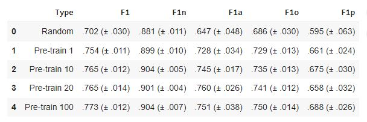
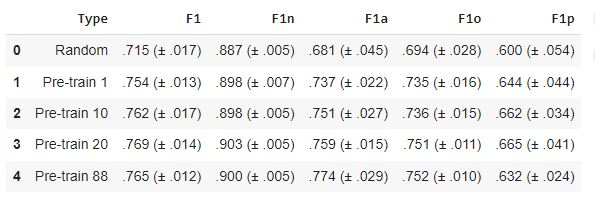
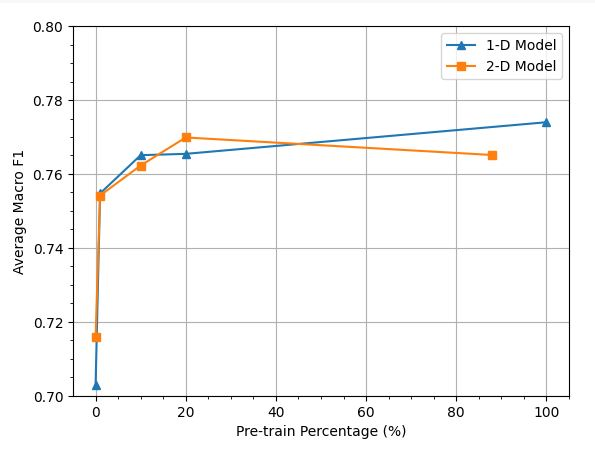
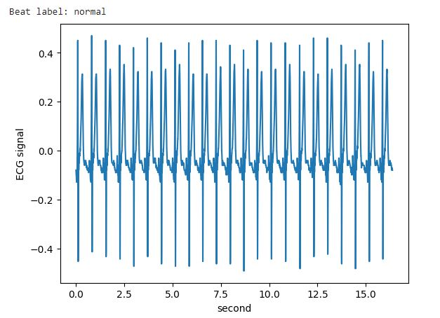
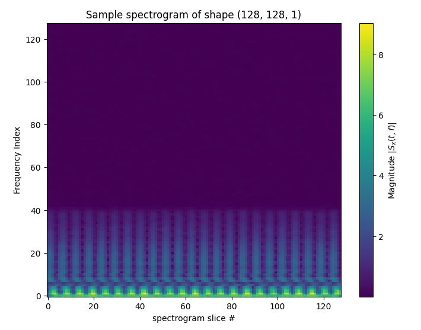

# Transfer Learning for ECG Classification
This is Team 1's project to perform replication work of the paper by Weimann and Conrad. The project deliverables can be found in the [report](report) directory.

Specifically, we reproduced the paper's results for the following pre-training task:
- Model: 1-D ResNet-18v2
- Pre-training Objective: Beat Classification
- Frame Size: 4096 samples
- Sample Rate: 250 Hz
- Fine-tuning objective: Atrial Fibrillation

We also evaluated the effects of pre-training datasize on the fine-tuned models performance, as evaluated by the macro F1 score on 1% , 10%, 20% and 100% of the pretraining data. The results are shown here:



Finally, we extended the author's results by preprocessing the ECG signals into a spectrogram, and using a 2DResNet instead of the original author's 1D Resnet model. the hyperparameters chosen for the spectrogram are shown here:
- Window size: 256 (~1 second)
- Stride: 32 (~0.13 seconds)
- Window type: hanning -> this is like a pre-defined convolution that is used to smooth the FFTs for each spectrogram slice
- Normalization: Remove mean from each sample
- Scale: linear (not db)

The fine-tuned model performance results are shown in the table below:




The below plot compares the 1DResnet performance to the 2dResnet performance as a function of pre-training data:



While the pre-training advantage shown in the original paper was replicated for the 2dResNet model, we did not show increased performance from the spectrogram pre-training and larger 2D resnet (11.2 million parameters vs 4.5 million parameters).


For reference, below shows a "normal" beat for a pretraining sample of Patient 0:







Citation:

> Weimann, K., Conrad, T.O.F. Transfer learning for ECG classification. Sci Rep 11, 5251 (2021). https://doi.org/10.1038/s41598-021-84374-8

## Running the code

Use Python 3.10 or greater. Install dependencies:

```bash
pip install -r requirements.txt
```

Then obtain the Icentia11K dataset and the PhysioNet/CinC Challenge 2017 dataset.

Then follow the instructions in the Pre-training [directory](pretraining) to pre-train a model.

Finally, follow the instructions in the Fine-tuning [directory](finetuning) to fine-tune a model using the pre-trained weights produced by the previous step.

---

Below this line is the original README.

Scripts for [Pretraining](pretraining) and [Finetuning](finetuning) residual networks on ECG data.

## Reproducing results and evaluation code. 
For complete details on how to reproduce our results, including evaluation code, please see our full report [here](report/DL4H_Team_1.ipynb)

## Pre-trained model weights
Note that these model weights have already been preprocessed with the pretraining.utils.get_pretrained_weights to remove the classification layer - they are ready for use in fine-tuning. 

### 1DResnet pretrained weights:
Pre-trained model weights with patients 0-2047 of the _Icentia11k_ dataset (~20%) can be downloaded from Google Drive [here](https://drive.google.com/file/d/1-9hQzriOv6y6DUu_ND23lwqGo6zv78yv/view?usp=sharing).

Pre-trained model weights we trained with all patients of the _Icentia11k_ dataset (100%) can be downloaded from Google Drive [here](https://drive.google.com/file/d/1-I6J8AEJaWiNI88LGQ5tjLOVMd-qbxdu/view?usp=sharing).

### 2DResnet (spectrogram) pretrained weights:
Pre-trained model weights we trained with patients 0-2047 of the _Icentia11k_ dataset (~20%) can be found downloaded from Google Drive [here](https://drive.google.com/file/d/1-2rY0cxoLG1xK-L7RNKNwX0fDDtpT5oo/view?usp=sharing).


Pre-trained model weights we trained with patients 0-9680 of the _Icentia11k_ dataset (~88%) can be found downloaded from Google Drive [here](https://drive.google.com/file/d/13Lv9ZLW2s9-ABLBIMRiK6NULWoQJ6_7j/view?usp=drive_link).


## Installation

Make sure that your virtual environment satisfies the following requirements before running any code:

* Python version: `>=3.10`
* Dependencies: `pip install -r requirements.txt`
